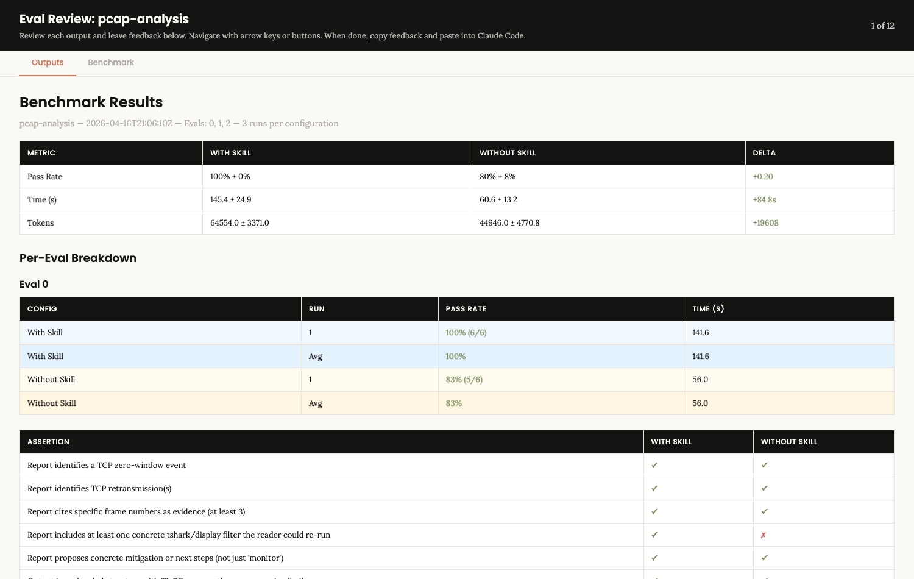

# pcap-analysis

A production-grade [Claude Code skill](https://docs.claude.com/en/docs/claude-code/skills)
that analyzes packet captures the way a senior network or security engineer would —
from a raw `.pcap` to a structured, evidence-backed report. This repo holds the
skill, the self-contained sandbox it runs in, and the evaluation harness used to
build and measure it.

It's also a worked example of building an LLM capability properly: clear
architecture, graceful degradation, and a reproducible benchmark rather than a
"trust me, it works."

## What this repo demonstrates

- **A skill with a real architecture** — progressive disclosure (a lean
  `SKILL.md` orchestrator + on-demand reference playbooks + tactical scripts),
  four-tier graceful degradation by available tooling, and dual-mode routing
  (performance troubleshooting vs. security/IR). See [`DESIGN.md`](DESIGN.md).
- **Evidence-first output** — every finding in a report is backed by a re-runnable
  `tshark` filter and frame references. *"A sentence without a filter behind it is
  a guess."*
- **A reproducible eval harness** — synthetic captures with known ground truth,
  with-skill vs. without-skill runs, and **deterministic, no-LLM-judge** grading.

## The evidence

Each of three scenarios was run with and without the skill (same model, same
prompt) and graded by deterministic predicates ([`grade.py`](skill-dev/pcap-analysis-workspace/grade.py)):

| | With skill | Without skill |
|--|-----------|---------------|
| **Pass rate** | **100% ± 0%** | 80% ± 8% |

The most telling gap: without the skill, the baseline flagged a benign host
(`example.com`) as a "secondary C2 server" — a false-positive IOC that would
pollute a SIEM. The skill correctly cleared it.

→ Full write-up: [**examples/before-after-benchmark.md**](examples/before-after-benchmark.md)
· Interactive per-assertion report:
[**view live**](https://htmlpreview.github.io/?https://github.com/Fromzy1/pcap-analysis-sandbox/blob/main/skill-dev/pcap-analysis-workspace/iteration-1-review.html)
([raw](skill-dev/pcap-analysis-workspace/iteration-1-review.html))



## Worked examples

Real questions, the sample capture, and the actual report the skill produced:

| Example | Angle | Demonstrates |
|---------|-------|--------------|
| [beacon-c2-detection](examples/beacon-c2-detection/) | Security / IR | Beacon periodicity → SIEM-ready IOCs, without false-flagging a benign host |
| [dns-cascade-502](examples/dns-cascade-502/) | Performance / RCA | Separating a DNS failure (NXDOMAIN) from a backend failure (HTTP 502) |
| [slow-checkout-stall](examples/slow-checkout-stall/) | Performance / RCA | Pinning a hang to a TCP zero-window event, with the exact frame + filter |

## Explore

- [**DESIGN.md**](DESIGN.md) — architecture, design decisions, eval methodology, trade-offs.
- [**examples/**](examples/) — worked examples and the benchmark.
- [**skill-dev/pcap-analysis/**](skill-dev/pcap-analysis/) — the skill itself
  (`SKILL.md`, scripts, references, evals).
- [**skill-dev/pcap-analysis-workspace/**](skill-dev/pcap-analysis-workspace/) —
  the eval harness (grader, run outputs, HTML report).
- [**SETUP.md**](SETUP.md) — install/run the sandbox locally.

## Quick start

```sh
source ./activate.sh          # enter the sandbox (tshark, scapy, duckdb, …)
bash skill-dev/pcap-analysis/scripts/triage.sh pcaps/eval-beacon.pcap
```

Full setup details are in [SETUP.md](SETUP.md).
